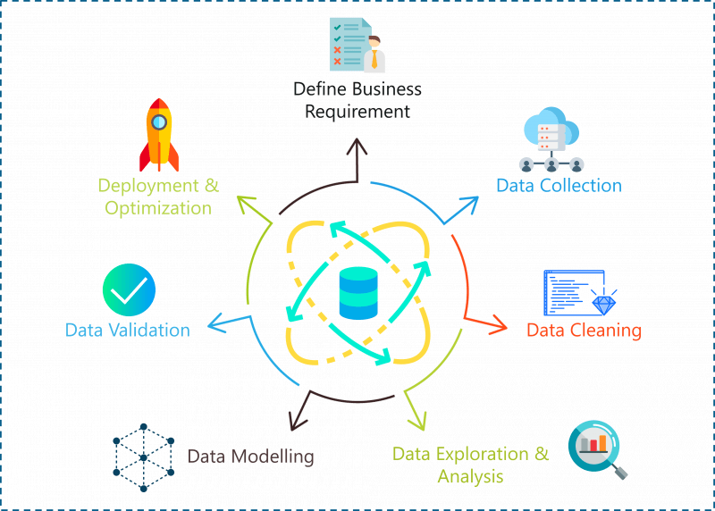

**BanCOLOMBIA sin fronteras**

**Nous - Dataton Bancolombia 2019**

En nuestro equipo creemos fuertemente en tres valores principales, el primero es que el uso de cualquier tecnologia, llamese desarrollo de software, machine learning, inteligencia artifical, realidad virtual, entre otras; deben estar enfocadas cien por ciento en las personas, enfocadas en brindar mayores oportunidades y bienestar a estas; el segundo es que el valor esta en el uso, por lo que cualquier solución que este enfocada en el primer valor debe ser funcional, asequible y accesible; y el ultimo valor en el que creemos firmemente es que para lograr los otros dos valores todas los proyectos y soluciones deben ser desarrollados por equipos multiculturales y multidisciplinarios.

Con estos valores en mente, nace el proyecto **BanCOLOMBIA sin fronteras**, el cual busca a traves del uso de tecnologias exponenciales aprovechar los datos adquiridos por la compañia para llevar igualdad en oportunidades a todos los ciudadanos de Colombia a traves del otorgamiento de un voto de confianza que se puede convertir en una oportunidad que lograra cambiar miles de vidas y llevarnos a un país mas justo y equitativo. Teniendo presente que el modelo es una parte crucial y critica del proyecto, pero que el despliege y uso del mismo definiran su verdadero valor e impacto en el mundo.

**Modelo**

El proyecto fue estructurado y desarrollado bajo la metodología para proyectos de ciencia de datos conocida como "data science project lifecycle"; la cual nos entregó un marco de referencia para poder explorar y desarrollar de forma exitosa el proyecto.

 

La metodología se divide en varias etapas, en las cuales, como su nombre lo indica, se trabaja de forma iterativa, lo cual permite un perfeccionamiento y avance ágil en el proyecto.

**Entendimiento del problema (business understanding)**

** **

El primero paso fue entender y estudiar el reto que se nos estaba proponiendo. Para esto realizamos una revisión bibliográfica de otros proyectos en el mundo que hubiesen trabajado en el cálculo del riesgo a partir de la traza digital de las personas. Esto nos permitió familiarizarnos con el tema; encontrando por ejemplo que, para este tipo de proyectos, factores como el año de la transacción, la alta interactividad con la aplicación, y los montos manejados se presentaban como factores claves para tener en cuenta.

 

Posteriormente realizamos una revisión rápida de las características (columnas) que nos entregaba el reto, comenzamos a generar hipótesis y preguntas que nos aportarían gran valor en el modelo, algunas de estas preguntas fueron:

 

 - ¿Cuánto es el máximo valor realizado para un cliente en una transacción durante el tiempo que se esta analizando, y cómo se comporta este valor con respecto al promedio de los otros clientes?
 - ¿Cuáles eran los productos que más sesiones tenían en cada uno de lo clientes?
 - ¿Cuáles eran los tiempos (horas, días, minutos, etc.) donde mas se conectaban las personas?
 - ¿Cuáles eran los canales y dispositivos que mas usaban las personas?
 -¿Existe una correlación entre las cantidades de transacciones fallidas y la culpa del banco en estas transacciones para determinar el incumplimiento del pago del producto crediticio?
 - ¿Podemos usar todas estas características y correlacionarlas de alguna manera con la segmentación inicial que realizo el banco para extraer mas valor de estas columnas?

**Primera aproximación a los datos (data collection and EDA)**

El siguiente paso fue cargar y pre-procesar los tres conjuntos de datos que presentaba el proyecto (identificación usuarios, data transaccional y los metadatos de los datos transaccionales), llegando a una base de datos que contenía todas las interacciones de los clientes, con 57.910.458 registros, y 8 características por transacción, además de variables claves como la función objetivo, y si los datos pertenecían a entrenamiento o a datos de evaluación.

 

 Es importante comentar que, dado el alto volumen de datos, evaluamos el uso de dos posibles soluciones:

  - Cargar y procesar los datos a través de técnicas de "big data" usando el entrono de Spark  en plataformas como Databricks.
  - Crear una maquina virtual de EC2 , el servicio de computación en la nube de Amazon Web Services.

 
Luego de probar las dos alternativas encontramos que la decisión más práctica era trabajar con la maquina virtual, ya que, aunque se contaba con una gran cantidad de registros, no tenían el suficiente volumen para impedir su procesamiento de manera práctica y eficiente en un entorno virtual tradicional, guardando los resultados en archivos tipo "pickle", los cuales ofrecen una excelente velocidad de guardado y de cargado.

Luego de cargar los datos, se procedió a realizar un pre-procesado básico, el cual buscaba extraer información de las fechas como el año, mes, día, semana del año, horas y segundos, de los datos transaccionales.

Para realizar el EDA usamos una librería de Python llamada "pandas_profiling", la cual se encarga de generar un informe analizando cada una de las variables, valores faltantes y correlación entre variables. El informe puede ser observado en la siguiente pagina y en los anexos: [https://camarin24.github.io/app.dataton2019/](https://camarin24.github.io/app.dataton2019/)

 

Posteriormente comenzamos un primer análisis de los datos que teníamos, entendiendo factores claves como:

 - Cuántos casos se presentan de las dos categorías de la variable objetivo (pago-impago) y cual es la proporción de estos datos
 - Investigamos las distribuciones para variables como el segmento de los dos grupos, observando que sí existían distribuciones características para cada una de las variables.
 - Encontramos datos claves como concurrencia por año, meses, etc.
 - Graficamos la matriz de correlación de las variables, observando que ninguna de las características hasta ahora presentaba alta correlación con la variable objetivo.

 

**Creación inicial de características (feature engineering)**

El primer paso en el proceso de crear nuevas características o "features" fue comenzar a responder las preguntas que nos habíamos generado en un principio, por lo que agrupamos cada una de las variables categóricas que teníamos, y encontramos el numero de sesiones únicas para cada una las posibles opciones que se tenían.

 

Este primer paso creó un poco más de 1000 columnas nuevas. Continuamos calculando factores estadísticos como las sumas totales, máximos, mínimos, promedios, y desviaciones de variables claves como el monto de la transacción, y el comportamiento de las transacciones por fechas.

 

Además, como observamos en el EDA, la variable segmento podría presentar una gran cantidad de información, pero de acuerdo con la explicación recibida, estos valores no tenían un carácter jerárquico, por lo que decidimos convertir cada uno de los segmentos en una columna aparte, a través de la técnica conocida como "one hot encoding". 

**Modelado inicial**

Esta primera creación de variables nos entrego un base de datos con 1110 características nuevas, con la cual decidimos comenzar a realizar el proceso cíclico dentro de la ciencia de datos: Creación de variables – modelado- evaluación de estas nuevas características en el modelo.

 

Pero para esto necesitamos escoger cual o cuales iban a ser nuestros modelos, por lo en un principio decidimos evaluar varios modelos de clasificación, realizar una validación cruzada para evitar temas de "overfitting" en los modelos, y escoger el modelo con un mayor rendimiento. Los modelos escogidos inicialmente fueron una regresión logística, un “random forest”, un clasificador Adam y el modelo de ensamble XGBoost. Luego de evaluar todos los modelos, encontramos que el mejor modelo, tanto en desempaño, como en explicabilidad de las variables más importantes era el XGBoost, lo cual nos llevó a escogerlo como nuestro modelo base.

 

**Evaluación del modelo inicial**

Se realizo una evaluación inicial del modelo, con los híper-parámetros por defecto, obteniendo que las variables creadas si presentaban aporte de información al modelo, ya que el resultado de la evaluación cruzada fue superior al "baseline" del modelo. Además, quisimos aprovechar el peso que le da el método a cada una de las variables para entender mejor de donde éste obtenía información valiosa, y cómo estos valores nos podían ayudar a crear nuevas variables. Esto nos permitió generar nuevas hipótesis como:

 - ¿Qué tanta diferencia existe entre la fecha de la ultima transacción con respecto al momento en que se tomo el producto crediticio?
 - Si identificamos la importancia de los segmentos en el modelo, ¿podemos crear otra segmentación con las nuevas variables creadas
 - ¿Cómo entregarle al modelo información sobre la incidencia de los dos tipos de sucesos?
 - ¿Puede ser el "mean encoding" una técnica útil para dar mayor importancia a la segmentación del modelo?
 - ¿Si eliminamos las variables que le aportan poca información al modelo, éste mejorara su rendimiento?

** **

**Iteración sobre la creación de características (feature engineering)**

 

Posteriormente generamos un EDA final con las variables más importantes que nos entregó el modelo, buscando nuevas relaciones que pudiesen aportar más información en el modelo (ver anexos); esto combinado con las preguntas que nos había generado el modelo, y nuevamente de manera iterativa, nos permitió crear más características e ir evaluando su aporte al modelo. El EDA final con las variables mas importantes puede ser visto en el siguiente enlace:

[https://camarin24.github.io/app.dataton2019/bancolombiaEDAfinal.html](https://camarin24.github.io/app.dataton2019/bancolombiaEDAfinal.html)

 

En el caso de la segmentación usamos un algoritmo de KMeans, mediante el cual encontramos que, teniendo en cuenta las 80 variables que más información le aportan al modelo, el número óptimo de segmentos era de 250. Esta clasificación, junto al cálculo de las diferencias en fechas en el modelo, y el cálculo del porcentaje de incidencias por variable objetivo mejoró de manera significativa los resultados.

Cabe mencionar que, al probarse otro tipo de técnicas, como la creación de variables de manera aleatoria, el uso de la técnica "mean enconding", agrupamientos por fechas, autoencoder, entre otros; sólo se logró a una disminución en la calidad del modelo, ya fuese por que bajaba su poder de predicción al aumentar la variabilidad del modelo, o porque el uso de estas técnicas conllevaba un aumento grande en el sobre ajuste del modelo.

 

**Modelado final**

Con el proceso de creación de variables finalizado, se procedió a la realización del modelado final, que buscaba encontrar los híper-parámetros óptimos que llevaran a obtener un modelo con bajo sesgo, y baja variabilidad.

 

Para esto evaluamos el uso de dos técnicas de búsqueda de híper-parámetros: La primera es "grid search", que busca realizar todas las posibles combinaciones de parámetros para maximizar la función objetivo, aunque es usada comúnmente con buenos resultados, presenta el problema de ser una búsqueda sin heurística y demasiado costosa computacionalmente.

 

La segunda opción, fue realizar una búsqueda de estos parámetros a través la técnica conocida como búsqueda bayesiana de híper-parámetros, esta técnica consiste en usar la información de las búsquedas anteriores para calcular la probabilidad de que una nueva combinación de parámetros mejore su desempeño, debido a la eficiencia y a los buenos resultados presentados por esta técnica decidimos utilizarla.

 

**Evaluación del modelo**

El ultimo paso en el modelado fue predecir los nuevos valores para los clientes que no habían sido evaluados, para esto calculamos las mismas características calculadas anteriormente en el ambiente de desarrollo y procedimos a entrenar el modelo con los híper-parámetros optimizados, prediciendo los nuevos valores.

 

Además, decidimos desplegar el modelo en un API para generar fácilmente nuevas predicciones y generar valor a través de ellas.

 

 

**Despliegue**

** **

**Web services y predicciones.**

La base de datos con la traza digital de cada usuario fue cargada en una base de datos no relacional en la plataforma de AWS que permite una rápida consulta sin necesidad de cargar toda la información en memoria.

 

Posteriormente se creó una función Lambda en la misma plataforma, que es consumida a través del servicio de API Gateway. Esta función recibe el id del usuario y calcula algunas estadísticas de su nivel de uso de la plataforma y la probabilidad de que éste entre en mora, además de identificar los diferentes productos presentes en su traza digital. Esta API sería consumida por una aplicación web que permite al usuario conocer de manera amigable algunos datos sobre su traza digital, además de recibir posibles ofertas del banco.

 

**Aplicacion de despliege**

Para la parte final de exposición y uso real del model optamos por el desarrollo de una aplicación que nos permitiera contar no solo entregar un resultado, si no que a la vez que integramos información valiosa de analitica, experiencia de usuario, y entregamos el
resultado final de aprobación del crédito de una experiencia novedosa y llamativa utilizando las tecnologías web más reciente. (PWA, AR).
Esta aplicación fue desarrollada utilizando React cómo framework base ya que permite una gran flexibilidad y velocidad en el desarrollo, además de una correcta integración y visualización tanto en el ambito web como en el mobile.

Esta aplicación obtiene todos sus datos mediante el llamado a API’s REST expuestas en AWS.Adicional a esto, la aplicación cuenta con la integración de una tecnología extremadamente potente y novedosa de la WEB cómo lo es el realidad aumentada.

**ANEXOS:**

Fig 1: Matriz de correlación variables con mayor explicabilidad

Fig 2: Pairplot variables con mayor explicabilidad

